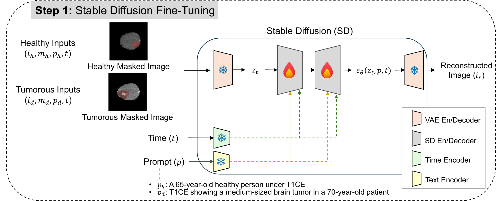
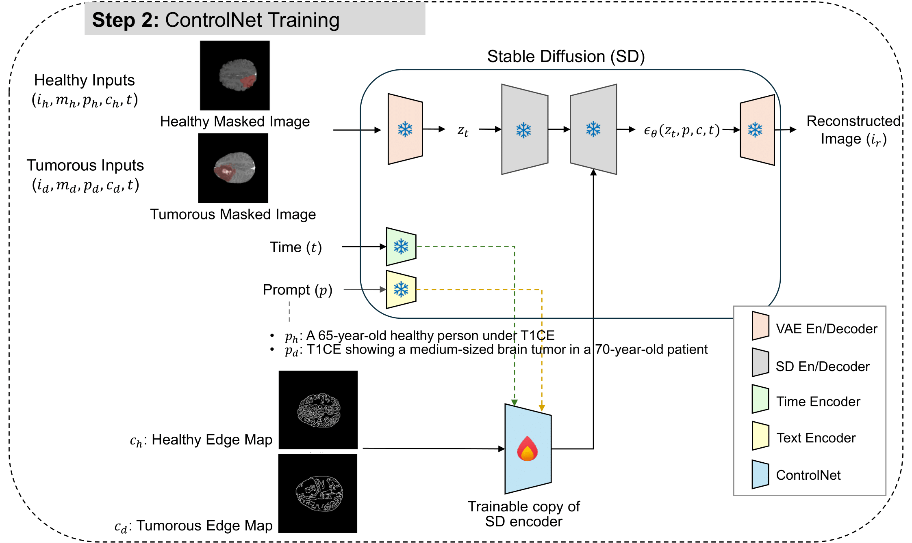
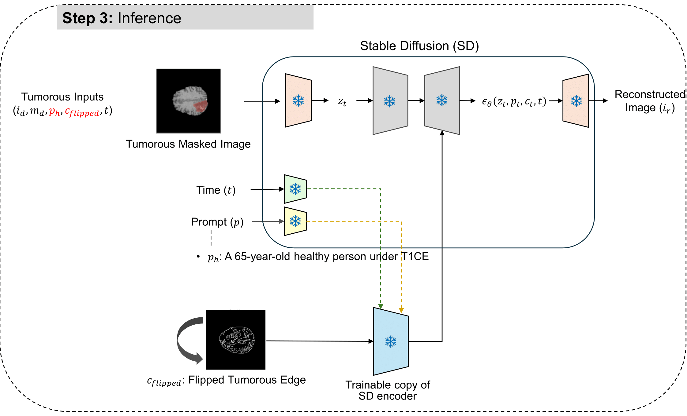
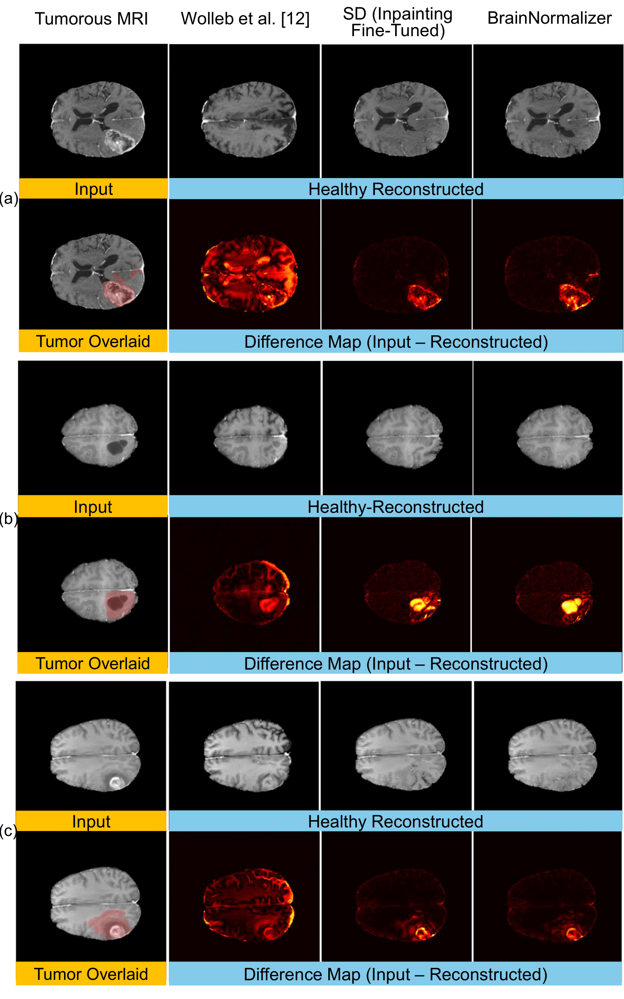
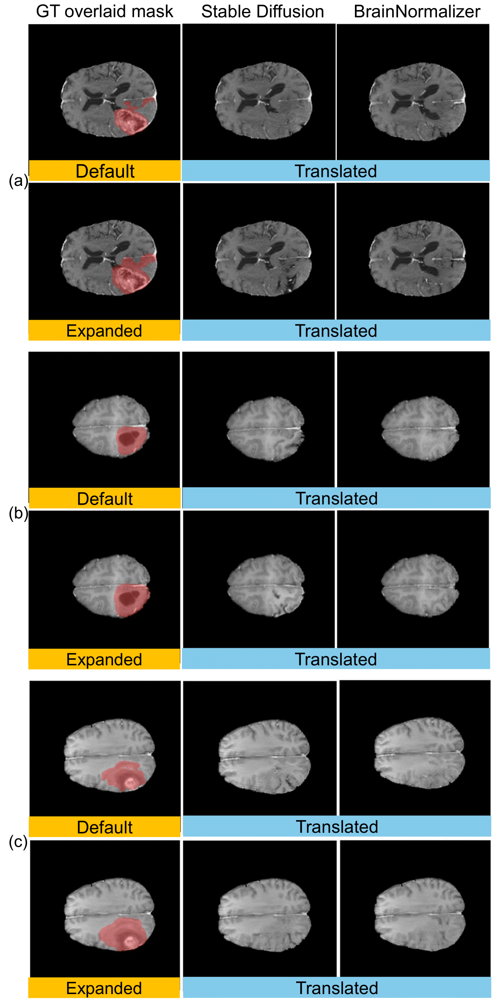

# 🧠 BrainNormalizer: Reconstructing Healthy Brain Images from Tumor MRIs using Masked ControlNet with Edge Conditioning

## 🎯 Background and Motivation

In brain tumor treatment, accurate interpretation of brain MRI is crucial for tumor delineation, treatment planning, and surgical decisions. A **patient-specific healthy baseline brain image** would provide tremendous value for:
- Precise tumor boundary identification
- Treatment response assessment  
- Surgical planning and guidance

However, this poses a fundamental challenge:
- **No pre-disease baselines exist**: Patients typically do not undergo MRI scans before tumor development
- **High anatomical variability**: Each patient's brain structure is unique, making generic healthy brain templates unsuitable
- **Need for patient-specific reconstruction**: A personalized approach is required to generate realistic healthy brain images

## 💡 Our Approach

Previous methods for tumor removal in brain MRI often fail to preserve anatomical structures. We developed **BrainNormalizer**, a novel framework that leverages **Canny Edge Maps** with **ControlNet** to:
- ✨ Remove tumor regions from diseased brain MRI
- 🔧 Reconstruct healthy tissue while **preserving patient-specific anatomical structures**
- 🎨 Utilize edge conditioning to maintain structural integrity during inpainting

> **🔑 Key Innovation:** Our method exploits the domain knowledge that **healthy brains are roughly symmetric**, using flipped edge maps as structural guidance for the generation process.

---

## Repository Structure

```
tumor-controller/
├── dataset/
│   ├── preprocessing/
│   │   ├── 1_prepare_image.py       # Image preprocessing & normalization
│   │   ├── 2_prepare_prompt.py      # Prompt generation & edge map creation
│   │   └── helper.py                # Utility functions
│   ├── brats.py                     # Dataset loader
│   └── transforms.py                # Data augmentation
├── trainer/
│   ├── ldm.py                       # LDM fine-tuning trainer
│   └── controlnet.py                # ControlNet trainer
├── config/
│   ├── ldm.py                       # LDM configuration
│   └── controlnet.py                # ControlNet configuration
├── yaml/
│   ├── ldm_inpaint.yaml            # LDM training config
│   ├── controlnet.yaml             # ControlNet training config
│   └── generate_controlnet.yaml    # Inference config
├── finetune_ldm.py                 # Step 1: LDM fine-tuning
├── train_controlnet.py             # Step 2: ControlNet training
├── generate_controlnet.py          # Step 3: Image generation
├── checkpoints/                    # Saved model checkpoints
├── image_generation/               # Generated results
└── requirements.txt                # Python dependencies
```

---

## 📊 Dataset

### Data Source
We use the **BraTS 2020** (Brain Tumor Segmentation Challenge 2020) dataset, which contains:
- Multi-modal MRI scans (T1ce, T2, FLAIR, T1)
- Expert-annotated tumor segmentation masks
- ~369 patients with glioblastoma

### Preprocessing

#### **Step 1: Image Preprocessing** (`dataset/preprocessing/1_prepare_image.py`)

This script processes raw BraTS NIfTI files and generates normalized, padded 2D slices:

```bash
python dataset/preprocessing/1_prepare_image.py
```

**What it does:**
- **Slice Selection**: Extracts axial slices (z=80-130) containing meaningful brain tissue
- **Spatial Padding**: Pads images to 256×256 using symmetric padding
- **Intensity Normalization**: Clips at 99.5 percentile and applies min-max normalization to [0,1]
- **Edge Map Generation**: Creates Canny edge maps (both standard and Gaussian-blurred versions)
- **Tumor Filtering**: Filters slices by tumor size (1000-3000 pixels) to focus on moderate tumors
- **Segmentation Masks**: Extracts binary tumor masks from annotations

**Output Structure:**
```
data/
├── tumor/                          # Tumor-bearing slices
│   ├── {patient_id}-brain-{modality}-{slice}.pkl      # Normalized brain image
│   ├── {patient_id}-edge-{modality}-{slice}.pkl       # Canny edge map
│   ├── {patient_id}-edge_blur-{modality}-{slice}.pkl  # Blurred edge map
│   └── {patient_id}-seg-{slice}.pkl                   # Tumor mask
├── healthy/                        # Healthy slices (no tumor)
│   └── [same structure as tumor/]
├── preprocessing_config.json       # Preprocessing parameters
├── normalization_minmax_stats.csv  # Min/max values per patient
└── tumor_slice_stats.csv          # Tumor size statistics
```

#### **Step 2: Metadata & Prompt Generation** (`dataset/preprocessing/2_prepare_prompt.py`)

This script creates structured metadata files with prompts and file paths:

```bash
python dataset/preprocessing/2_prepare_prompt.py
```

**What it does:**
- **Metadata Creation**: Generates JSON files containing all file paths for each slice
- **Prompt Building**: Creates text descriptions (e.g., "A brain MRI with a medium-sized tumor")
- **Patient Information**: Links clinical data (age, survival info) when available

**Output Structure:**
```
data/
└── meta/
    ├── tumor/
    │   └── {patient_id}-{modality}-{slice}.json
    │       {
    │         "patient_id": "001",
    │         "modality": "t1ce",
    │         "slice": "95",
    │         "tumor_size": "2450",
    │         "age": "65",
    │         "image": "/path/to/brain.pkl",
    │         "edge": "/path/to/edge.pkl",
    │         "edge_blur": "/path/to/edge_blur.pkl",
    │         "seg": "/path/to/seg.pkl",
    │         "label": "1"
    │       }
    └── healthy/
        └── [similar structure with label "0"]
```

---

## 🚀 Model Framework

Our framework consists of three sequential stages:

### **Stage 1️⃣: Fine-tuning Latent Diffusion Model (LDM) for Inpainting**

<p align="center">
  
</p>

**Script:** `finetune_ldm.py`

**Purpose:**  
Fine-tune Stable Diffusion v1.5 to learn:
- Domain-specific features of brain MRI (tumor vs. healthy tissue)
- Inpainting capabilities for tumor region removal
- Medical image characteristics and intensity distributions

**Configuration:** `yaml/ldm_inpaint.yaml`

Key parameters:
- `modality`: Choose modality (t1ce, t2, or t1ce+t2)
- `resolution`: 512×512
- `num_train_epochs`: 30
- `learning_rate`: 5e-5
- `offset_noise`: True (for better texture generation)
- `dilation_size`: 5 (mask expansion)
- `sigma`: 5.0 (Gaussian smoothing for mask boundaries)

**Usage:**
```bash
# Edit yaml/ldm_inpaint.yaml to set your parameters
python finetune_ldm.py --config yaml/ldm_inpaint.yaml

# Or override parameters via command line
python finetune_ldm.py --config yaml/ldm_inpaint.yaml \
    --learning_rate 1e-4 \
    --num_train_epochs 20
```

**Output Structure:**
```
checkpoints/finetune_ldm_inpaint/{experiment_id}/
├── configs.json                    # Training configuration
├── unet/                          # Fine-tuned UNet weights
│   ├── config.json
│   └── diffusion_pytorch_model.safetensors
├── checkpoint-{step}/             # Intermediate checkpoints
│   └── unet/
└── logs/                          # Training logs
    └── events.out.tfevents.*      # TensorBoard logs
```

---

### **Stage 2️⃣: Training ControlNet with Edge Conditioning**

<p align="center">
  
</p>

**Script:** `train_controlnet.py`

**Purpose:**  
Train a ControlNet model on top of the fine-tuned LDM to:
- Accept Canny edge maps as structural guidance
- Learn to respect anatomical boundaries during inpainting
- Maintain edge consistency between input and output

**Configuration:** `yaml/controlnet.yaml`

Key parameters:
- `ldm_inpaint_hash`: Experiment ID from Stage 1 (e.g., "2025-08-08_11-14-10")
- `learning_rate`: 5e-4 (higher than LDM, as ControlNet trains faster)
- `edge_blur`: True (use Gaussian-blurred edge maps for robustness)
- `controlnet_conditioning_scale`: 0.8 (control strength of edge guidance)

**Usage:**
```bash
# 1. First, find your LDM checkpoint ID
ls checkpoints/finetune_ldm_inpaint/
# Example output: 2025-08-08_11-14-10/

# 2. Edit yaml/controlnet.yaml and set:
#    ldm_inpaint_hash: "2025-08-08_11-14-10"

# 3. Run training
python train_controlnet.py --config yaml/controlnet.yaml
```

**Output Structure:**
```
checkpoints/controlnet/{experiment_id}/
├── configs.json                    # Inherited + ControlNet configs
├── controlnet/                    # Trained ControlNet weights
│   ├── config.json
│   └── diffusion_pytorch_model.safetensors
├── checkpoint-{step}/             # Intermediate checkpoints
│   └── controlnet/
└── logs/                          # Training logs
```

**Note:** The training inherits most hyperparameters from the LDM stage (modality, resolution, data splits, etc.) automatically by reading the LDM config.

---

### **Stage 3️⃣: Healthy Brain Image Generation**

<p align="center">
  
</p>

**Script:** `generate_controlnet.py`

**Purpose:**  
Generate patient-specific healthy brain images by:
1. **Input**: Tumor-bearing MRI image
2. **Prompt Reversal**: Use "healthy brain" prompt (opposite of training)
3. **⭐ Edge Flipping**: Flip edge map vertically to provide contralateral hemisphere guidance
4. **Inpainting**: Generate healthy tissue in tumor region while preserving structure

> **💎 Key Innovation:**  
> We exploit the **approximate bilateral symmetry** of healthy brains. By flipping the edge map, we provide structural guidance from the healthy hemisphere to reconstruct the tumor-affected region.

**Configuration:** `yaml/generate_controlnet.yaml`

Key parameters:
- `controlnet_id`: ControlNet checkpoint ID from Stage 2
- `num_steps`: 50 (inference steps, higher = better quality)
- `strength`: 1.0 (denoising strength)
- `guidance_scale`: 7.5 (CFG scale)
- `controlnet_conditioning_scale`: 1.0 (edge guidance strength)

**Expanded Mask Parameters** (for smoother boundaries):
- `sigma`: [3.0, 3.0] (Gaussian smoothing for mask expansion)
- `threshold`: 0.05 (threshold for binary mask after smoothing)

**DDIM Baseline Comparison** (optional):
- `ddim.image_dir`: Path to pre-generated DDIM results for comparison with the baseline method ([Wolleb et al., 2022](https://link.springer.com/chapter/10.1007/978-3-031-16452-1_4))

> ⚠️ **Note**: DDIM comparison is optional. If `ddim.image_dir` is not provided or images are missing, the visualization will simply skip the DDIM row.

**Usage:**
```bash
# 1. Find your ControlNet checkpoint ID
ls checkpoints/controlnet/
# Example: 2025-08-08_18-52-26/

# 2. Edit yaml/generate_controlnet.yaml and set:
#    controlnet_id: "2025-08-08_18-52-26"

# 3. Run generation
python generate_controlnet.py --config yaml/generate_controlnet.yaml

# 4. Override parameters if needed
python generate_controlnet.py \
    --config yaml/generate_controlnet.yaml \
    --num-steps 100 \
    --controlnet-conditioning-scale 0.8
```

**What Happens During Generation:**
1. **Load Models**: VAE, Text Encoder, fine-tuned UNet, and ControlNet
2. **Process Each Tumor Slice**:
   - Load original tumor image, segmentation mask, and edge map
   - **Reverse prompt** from "tumor" → "healthy"
   - **Flip edge map** vertically (left ↔ right hemisphere)
   - Generate with both **default mask** and **expanded mask** (smoother transitions)
3. **Save Results**: Generated images (numpy arrays) and visualization plots

**Output Structure:**
```
image_generation/{experiment_id}/
├── configs.json                    # Generation parameters
├── default/                        # Results with original tumor masks
│   ├── controlnet/
│   │   └── {patient_id}-controlnet-{modality}-{slice}.npy
│   ├── ldm/                       # LDM baseline (no edge conditioning)
│   │   └── {patient_id}-ldm-{modality}-{slice}.npy
│   └── plot/                      # Visualization plots
│       └── {patient_id}-overview-{modality}-{slice}.png
│           [4×4 grid: input, mask, overlay, edge | 
│            DDIM results | LDM results | ControlNet results]
└── expanded/                      # Results with expanded masks
    ├── controlnet/
    ├── ldm/
    └── plot/
        └── {patient_id}-comparison-{modality}-{slice}.png
            [2×5 grid comparing default vs. expanded masks]
```

**Visualization Outputs:**

1. **Overview Plot** (`default/plot/`): 4×4 grid showing
   - Row 1: Input image, mask, overlay, flipped edge map
   - Row 2: DDIM baseline results (if available)
   - Row 3: LDM inpainting results (no edge conditioning)
   - Row 4: ControlNet results (with edge conditioning)

2. **Comparison Plot** (`expanded/plot/`): 2×5 grid comparing
   - Row 1: Default mask results (LDM vs. ControlNet, translated vs. repainted)
   - Row 2: Expanded mask results (smoother boundary transitions)

---

## 📈 Visualization

### Results: Method Comparison & Robustness Analysis

<table>
<tr>
<td width="50%">

**Method Comparison**

Comparison of our ControlNet-based approach with baseline methods:



**Key observations:**
- **LDM (without edge conditioning)**: May lose fine anatomical details
- **ControlNet (with edge guidance)**: Preserves structural integrity while successfully removing tumors
- **Edge flipping strategy**: Leverages contralateral hemisphere information for realistic reconstruction

</td>
<td width="50%">

**Robustness to Mask Size**

Clinical applicability requires robustness to imprecise tumor delineation. We evaluate performance with **expanded ROI masks**:



> **💡 Clinical Relevance:** In real clinical settings, precisely delineating tumor boundaries is challenging and time-consuming. Our method demonstrates robust performance even when the input mask is expanded beyond exact tumor boundaries (ROI-style annotation), making it more practical for clinical deployment.

</td>
</tr>
</table>

### Overview Plots

The generation script produces comprehensive visualization plots showing:

**Default Mask Results** (`default/plot/`): 4×4 grid visualization
- **Row 1**: Input tumor image, segmentation mask, overlay, and flipped edge map
- **Row 2**: DDIM baseline results - *optional, shown only if available*
- **Row 3**: LDM inpainting results (without edge conditioning)
- **Row 4**: ControlNet results (with edge conditioning)

**Comparison Plots** (`expanded/plot/`): 2×5 grid comparison
- **Row 1**: Default mask results (LDM vs. ControlNet)
- **Row 2**: Expanded mask results (smoother boundary transitions)

**📄 Detailed quantitative evaluation and additional results will be provided in separate PDF documents.**

---

## ⚡ Quick Start

### 📋 Requirements
- Python 3.8+
- CUDA 11.7+ (for GPU acceleration)
- 32GB+ RAM recommended
- ~50GB disk space for checkpoints and data

### Full Pipeline Example

```bash
# 1. Preprocess data
python dataset/preprocessing/1_prepare_image.py
python dataset/preprocessing/2_prepare_prompt.py

# 2. Train LDM (Stage 1)
python finetune_ldm.py --config yaml/ldm_inpaint.yaml

# 3. Train ControlNet (Stage 2)
# First, update yaml/controlnet.yaml with your LDM checkpoint ID
python train_controlnet.py --config yaml/controlnet.yaml

# 4. Generate healthy images (Stage 3)
# Update yaml/generate_controlnet.yaml with your ControlNet checkpoint ID
python generate_controlnet.py --config yaml/generate_controlnet.yaml
```

---

## 🔬 Key Technical Details

### ⚙️ Edge Map Flipping (Critical Innovation)

```python
# In generate_controlnet.py
edge = data['edge']                    # Extract edge map from tumor image
prompt = reverse_prompt(prompt)        # "tumor" → "healthy"
edge = torch.flip(edge, dims=[1])      # ⭐ Flip horizontally (left ↔ right)

# Generate with flipped structural guidance
output = pipeline_controlnet(
    prompt="A healthy brain MRI",
    image=tumor_image,
    mask_image=tumor_mask,
    control_image=flipped_edge,        # Guide with contralateral structure
    ...
)
```

This leverages the **approximate bilateral symmetry** of healthy brains, allowing the model to use structural information from the healthy hemisphere to reconstruct the tumor-affected region.

### 🎭 Expanded Mask for Smooth Transitions

```python
# Gaussian smoothing + thresholding for natural boundaries
gaussian = GaussianSmooth(sigma=(3.0, 3.0))
mask_blurred = gaussian(mask)
mask_expanded = (mask_blurred > 0.05).float()

# Constrain to brain region
foreground_mask = (image != 0.0)
mask_final = mask_expanded * foreground_mask
```

This produces smoother, more realistic transitions between generated and original tissue.

---

## 🔧 Troubleshooting

### Common Issues

**1. Out of Memory (OOM) Errors**
```bash
# Reduce batch size in YAML config
train_batch_size: 4  # Instead of 8
gradient_accumulation_steps: 8  # Increase to compensate
```

**2. ControlNet Can't Find LDM Checkpoint**
```bash
# Check available checkpoints
ls checkpoints/finetune_ldm_inpaint/

# Update yaml/controlnet.yaml with correct ID
ldm_inpaint_hash: "2025-08-08_11-14-10"  # Use actual timestamp
```

**3. Generation Script Fails**
```bash
# Ensure ControlNet config exists
ls checkpoints/controlnet/{your_id}/configs.json

# Check YAML config points to correct checkpoint
vim yaml/generate_controlnet.yaml
# Update: controlnet_id: "{your_actual_checkpoint_id}"
```

---

## 🔮 Future Works

- [ ] Extension to 3D volume generation
- [ ] Handling tumors located at the brain center
- [ ] Multi-contrast MRI (T1ce, T2, FLAIR) simultaneous processing

---

**Last Updated**: November 2025 | **Status**: 🚧 In Active Development

