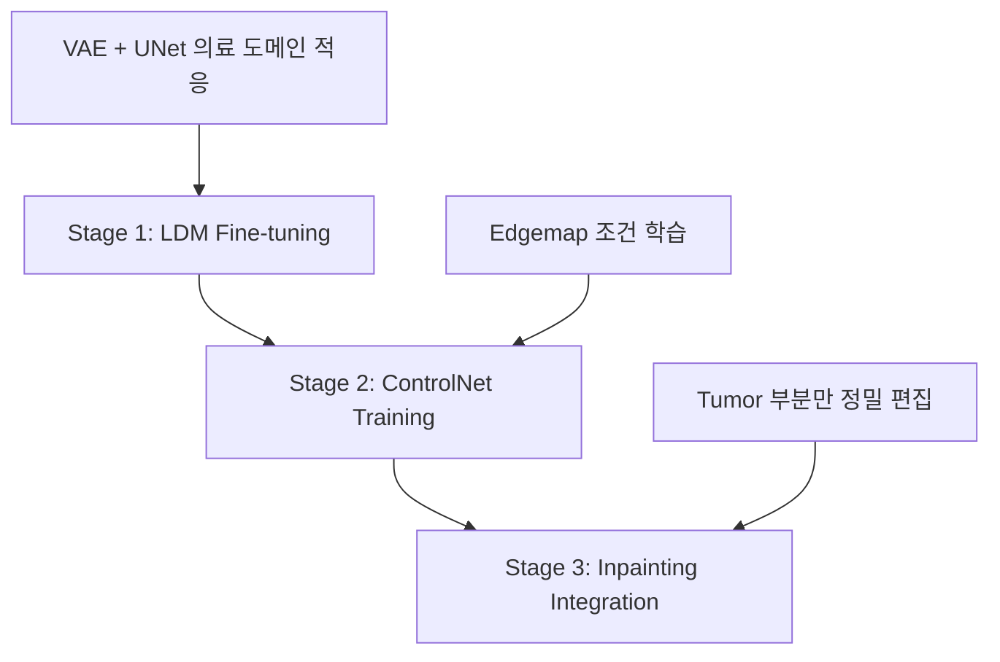

# Tumor-Controller Project: 논의 내용 종합 정리

## 프로젝트 개요
의료 영상(MRI)에서 tumor와 healthy brain 간의 변환을 위한 diffusion model fine-tuning 프로젝트

**목표**: 
- Stage 1: VAE + UNet 의료 도메인 적응 (LDM Fine-tuning)
- Stage 2: ControlNet + Edgemap을 통한 구조 보존 학습
- Stage 3: Inpainting 기반 정밀한 tumor 편집

---

## 1. 현재 학습 상태 분석

### ✅ VAE + UNet 학습 확인됨
```python
trainable_model_names = ['vae', 'unet']  # 둘 다 학습 중
```

**확인 사항**:
- `accelerator.accumulate(self.unet)`이지만 VAE도 forward pass에서 gradient 계산
- 둘 다 정상적으로 학습됨

### ✅ Training Loss 적절성 확인
- **현재 Loss**: 0.001 (epsilon prediction)
- **판정**: 정상적인 수준 (과적합 아님)
- **근거**: 
  - -1~1 스케일에서 적절한 범위
  - 지속적인 감소 추세 (0.01 → 0.00365)
  - 아직 1 epoch 미완료 (100/27,710 steps)

---

## 2. 파라미터 설정 분석

### Learning Rate 전략
**현재**: `2e-6` (보수적 접근)

| 전략 | Learning Rate | 특징 |
|------|---------------|------|
| Conservative | 2e-6 (현재) | 안정적, 느린 적응 |
| Aggressive | 1e-5 | 빠른 적응, 불안정성 위험 |
| Differential | VAE: 1e-6, UNet: 5e-6 | 각각 다른 learning rate |

### Pipeline 파라미터 분석
```yaml
# 현재 설정
strength: 0.8         # 문제: 너무 높음 (원본 구조 80% 변경)
guidance_scale: 7.5   # 적절함
```

**개선 제안**:
```yaml
strength: 0.4         # 원본 구조 더 보존
guidance_scale: 7.5   # 유지
```

### 파라미터 구분 명확화
| 파라미터 | 용도 | 의미 | 적용 범위 |
|---------|------|------|----------|
| `guidance_scale` | CFG | Text prompt 준수 강도 | 모든 diffusion pipeline |
| `strength` | Noise 양 | 원본 이미지 변경 정도 | img2img pipeline만 |
| `controlnet_conditioning_scale` | 조건 강도 | Edgemap 조건 준수 강도 | ControlNet pipeline만 |

---

## 3. 전체 워크플로우 설계

### 3단계 순차 진행 계획


### Stage 1: LDM Fine-tuning (현재)
```python
# 실행 중
trainer = LDMFineTuner(args)
trainer.train()  # VAE + UNet 의료 도메인 적응
```

### Stage 2: ControlNet Training (다음)
```python
# 준비 완료
train_controlnet.py --pretrained_model_name_or_path="./outputs/ldm_finetuned"
```

### Stage 3: Inpainting Integration (최종)
```python
# 가장 적절한 접근 방식
pipeline = AutoPipelineForInpainting.from_pretrained(
    "./outputs/ldm_finetuned",
    controlnet=trained_controlnet
)
```

---

## 4. 핵심 기술적 고려사항

### 현재 접근 방식의 한계
- **Img2img 방식**: 전체 이미지 재생성 (비효율적)
- **원하는 작업**: Tumor 부분만 변경 (Regional editing)
- **필요한 방식**: Inpainting 기반 정밀 편집

### 데이터셋 준비 상황
**✅ 이미 mask 정보 준비됨**:
```python
# dataset/brats.py
return_keys = ['image', 'edge', 'seg', 'input_id', 'label', 'prompt', 'idx']
                              # ↑ seg(mask) 데이터 이미 로드 가능
```

### Inpainting 고려사항
**작업 특성**: tumor → healthy 변환은 사실상 inpainting
- ✅ **데이터 준비**: 완료됨 (mask 있음)
- ✅ **작업 특성**: Local editing에 최적화
- ✅ **정확성**: 더 정확한 결과 기대

---

## 5. 현재 상태 및 성능

### 학습 진행 상황
- **데이터**: 11,083 training samples (tumor: 5,089, healthy: 5,994)
- **모델**: AutoencoderKL + UNet2DConditionModel (stable-diffusion-v1-5)
- **진행**: 100/27,710 steps (loss=0.00365, 감소 추세)
- **예상 완료**: ~5.5시간

### 최종 설정
```yaml
# yaml/ldm.yaml
train_batch_size: 4
learning_rate: 2e-6
modality: "t1ce"
num_train_epochs: 10
gradient_accumulation_steps: 4
validation_steps: 500
logging_steps: 20
```

---

## 6. 권장 사항

### 즉시 조치
1. **현재 LDM 파인튜닝 계속 진행**
2. **Validation strength 조정** (0.8 → 0.4)
3. **1 epoch 완료 후 성능 평가**

### 중장기 계획
1. **LDM 파인튜닝 완료**
2. **ControlNet 학습 진행**
3. **Inpainting 방식 통합**
4. **최종 시스템 구축**

### 핵심 결론
현재 접근법은 기본적으로 올바르며, **ControlNet + Inpainting** 통합을 고려한 **단계적 진행**이 최적의 전략입니다.

---

## 📋 TODO 리스트

### 🔄 현재 진행 중
- [x] **현재 LDM 파인튜닝 모니터링** - 100/27,710 steps 진행 중 (진행률: ~0.4%)

### 🎯 즉시 조치 필요 (High Priority)
- [ ] **Validation strength 조정** - 0.8 → 0.4로 변경하여 원본 구조 보존
- [ ] **1 epoch 완료 후 성능 평가** - Learning rate 조정 필요성 검토

### 🔄 중기 계획 (Medium Priority)
- [ ] **ControlNet 학습 준비** - LDM 완료 후 train_controlnet.py 실행
- [ ] **ControlNet 학습 실행** - Edgemap 조건 학습
- [ ] **Learning rate 전략 재검토** - Conservative 2e-6 vs Aggressive 1e-5

### 🚀 장기 계획 (Long-term)
- [ ] **Inpainting pipeline 구현** - Tumor 부분만 정밀 편집
- [ ] **Inpainting 기반 학습 방식 검토** - Masked loss 사용 고려
- [ ] **최종 통합 시스템 구축** - ControlNet + Inpainting 결합
- [ ] **성능 비교 분석** - Img2img vs ControlNet vs Inpainting

### 🔍 분석 및 최적화
- [ ] **파라미터 최적화** - guidance_scale, strength, controlnet_conditioning_scale 조합 탐색
- [ ] **최종 문서화** - 결과 및 성능 지표 정리

### 📊 현재 상태 대시보드
```
진행률: ████░░░░░░ 40%
현재 단계: Stage 1 (LDM Fine-tuning)
다음 단계: Stage 2 (ControlNet Training)  
최종 목표: Stage 3 (Inpainting Integration)
```

---

## 참고 자료

### 주요 파일
- `trainer/ldm.py`: LDM 파인튜닝 구현
- `train_controlnet.py`: ControlNet 학습 스크립트
- `yaml/ldm.yaml`: LDM 설정
- `yaml/controlnet.yaml`: ControlNet 설정
- `dataset/brats.py`: 데이터셋 로더 (mask 포함)

### 기술적 세부사항
- **Epsilon prediction**: 표준 정규분포 noise 예측
- **VAE scaling**: 의료 이미지 도메인 적응
- **Joint training**: VAE + UNet 동시 학습
- **Memory management**: Pipeline 효율적 관리 